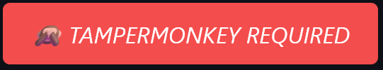

[***DISCONTINUED***]()

  
  

<pre>

Due to a huge inactivity of KoGaMa's Community, I no longer see it worth to work on this extension.
I also know of no active users of my extension, meaning I get no additional requests nor bug reports.

Thank you to everybody who supported and used it. I will move on to bigger and more advanced projects from now on. :)

The function to check for updates will be deleted in that final version to prevent overloading any sort of ToS.

I love you! - Simon.
In case you want to contact me, my Discord ID is: 970332627221504081.
You can also find me on GitHub at <a href="https://github.com/adouco"><b><u>github.com/adouco</u></b></a>.

</pre>

<h2>About Utilify</h2>

Utilify is a addon written in javascript that hopes to make features of KoGaMaBuddy as accessible as only possible to the general public. 
On top of porting KoGaMaBuddy's features it also adds countless new and never-seen before adjustments to boost your experience.

 

> [!TIP]
> Looking for suppor regarding Utilify? Trying to suggest a new feature?  
> Feel welcome to add me on discord @ [ctaah](https://www.kogama.com/profile/17769289/)

> [!NOTE]
> <h2>Utilify Contributors</h2>
> 

> I want to give <b>huge</b> thank you to everybody who has supported the project since it's beginning as well as helped finding bugs and solutions. 
> Not only that but so many people have provided me with ideas what to add and tweak for the best results. 
> </b>Seriously, thanks to each single one of you.  
> <i>I love you.</i> 
> <b> Awoi </b>, <b>Sorry</b>, <b>Raptor</b>, <b>Flavius</b>, <b>Tuna</b>, <b>Snowy</b>, <b>Idealism</b> and <b>Devorkk</b>  
> <i> All of you are wonderful</i>
  

  
> [!CAUTION]
> <h2>Important Information</h2>
> 

> This script requires a userscript manager like Tampermonkey to function properly.  
> Please note that scripts executed through userscript managers may not be trusted, and it's your responsibility to ensure the safety and legitimacy of the scripts you run. 
> If you choose to proceed, make sure to review the code and understand what it does. 
> You can install Tampermonkey from the link below:
> 

> 
>  
>   
>

> [!IMPORTANT]  
> <h2> Features & Installation</h2>
> 
> Please remember to stay safe and absolutely never try scripts that you don't understand or don't know origin of. 
> The only <b>safe place</b> to actually get Utilify from is only <a href="https://github.com/unreallain/Utilify/">this github respository</a>. 
> Never trust optional sources if you value your privacy. 
>   
>  
